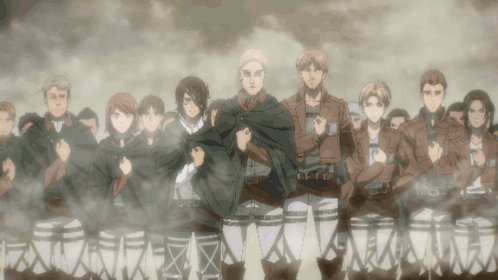

<table>
<tr>
<td width="75%" valign="top">

</td>
<td width="25%" align="center" valign="middle">

</td>
</tr>
</table>


<table width="100%" bgcolor="#1c0e24" cellpadding="0" cellspacing="0">

<tr bgcolor="#2e1248">
<td align="center">🔴&nbsp;🟡&nbsp;🟢&nbsp;&nbsp;&nbsp;&nbsp;salman@ubuntu: ~</td>
</tr>

<tr><td>

</td></tr>
<tr><td align="center">


</td></tr>
<tr><td>

</td></tr>
<tr><td align="center"><br/>


&nbsp;


<br/><br/>

<a href="https://git.io/streak-stats"></a>

<br/>

</td></tr>
<tr><td>

</td></tr>
<tr><td align="center"><br/>

<a href="https://stsfaroz.github.io/"></a>
&nbsp;
<a href="https://www.linkedin.com/in/salman-faroz"></a>
&nbsp;
<a href="mailto:stsfaroz@gmail.com"></a>


</td></tr>
</table>

---

<div align="center">



<br/>

> *「勝てば生き、負ければ死ぬ。戦わなければ勝てない。」*
>
> *"If you win, you live. If you lose, you die. If you don't fight, you can't win."*
>
> **— Eren Yeager · Attack on Titan**

<br/>

```bash
[session closed]  —  ⚔️ Scout Regiment · Research Division · Building intelligence, one commit at a time.
```

</div>
