<map name="contactmap">
<area shape="rect" coords="22,253,284,275" href="https://stsfaroz.github.io/" alt="Portfolio" target="_blank" rel="noopener">
<area shape="rect" coords="22,278,372,300" href="https://www.linkedin.com/in/salman-faroz" alt="LinkedIn" target="_blank" rel="noopener">
<area shape="rect" coords="22,303,284,325" href="mailto:stsfaroz@gmail.com" alt="Mail">
</map>

